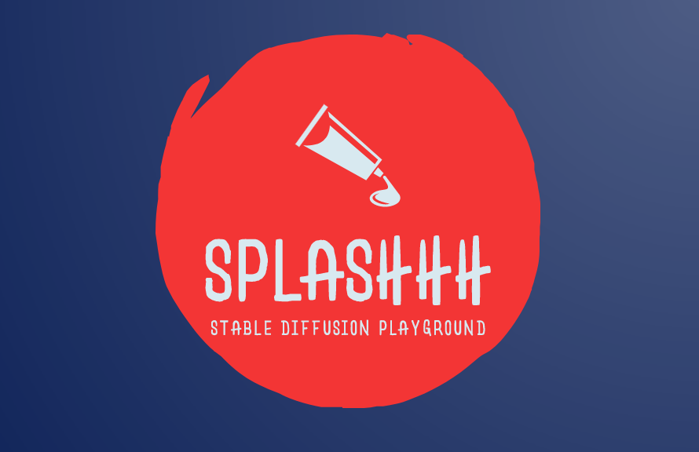

[//]: # (![Splashhh project logo]&#40;Splashhh-header-img1.webp&#41;)

# InvokeAI by Splashhh: A Stable Diffusion Playground

[![latest release badge]][latest release link] [![github stars badge]][github stars link] [![github forks badge]][github forks link]

[![CI checks on main badge]][CI checks on main link]

[CI checks on main badge]: https://flat.badgen.net/github/checks/splashhh-cc/splashhh-stable-diffusion-app/main?label=CI%20status%20on%20main&cache=900&icon=github
[CI checks on main link]: https://github.com/splashhh-cc/splashhh-stable-diffusion-app/actions/workflows/test-invoke-conda.yml
[github forks badge]: https://flat.badgen.net/github/forks/splashhh-cc/splashhh-stable-diffusion-appicon=github
[github forks link]: https://useful-forks.github.io/?repo=invoke-ai%2FInvokeAI
[github open issues badge]: https://flat.badgen.net/github/open-issues/splashhh-cc/splashhh-stable-diffusion-app?icon=github
[github open issues link]: https://github.com/splashhh-cc/splashhh-stable-diffusion-app/issues?q=is%3Aissue+is%3Aopen
[github open prs badge]: https://flat.badgen.net/github/open-prs/splashhh-cc/splashhh-stable-diffusion-app?icon=github
[github open prs link]: https://github.com/splashhh-cc/splashhh-stable-diffusion-app/pulls?q=is%3Apr+is%3Aopen
[github stars badge]: https://flat.badgen.net/github/stars/splashhh-cc/splashhh-stable-diffusion-app?icon=github
[github stars link]: https://github.com/splashhh-cc/splashhh-stable-diffusion-app/stargazers
[latest release badge]: https://flat.badgen.net/github/release/splashhh-cc/splashhh-stable-diffusion-app/development?icon=github
[latest release link]: https://github.com/splashhh-cc/splashhh-stable-diffusion-app/releases

This is a fork of
[invoke-ai/InvokeAI](https://github.com/invoke-ai/InvokeAI),
It provides a streamlined process with various new features and options to aid the image
generation process. It runs on Windows, macOS and Linux machines, with
GPU cards with as little as 4 GB of RAM. It provides both a polished
Web interface, and an easy-to-use command-line interface.

### Features

#### On top of the upstream INVOKE AI toolkit, we aim to provide:

- The ability to support multiple users simultaneously, with each user having their own set of saved images.
- A simple queueing mechanism to avoid overloading the server with multiple simultaneous requests.
- Harden the API to avoid intrusive changes such as model changes, model deletions, and other changes that could break the multi-user experience.
- Enforce reasonable maximum Limits to avoid long requests. This applies to the number of generated images, image sizes, iterations, and other parameters.

_Note: InvokeAI by Splashhh is rapidly evolving. Please use the
[Issues](https://github.com/splashhh-cc/splashhh-stable-diffusion-app/issues) tab to report bugs and make feature
requests. Be sure to use the provided templates. They will help us diagnose issues faster._

# Getting Started with Splashhh

For full installation and upgrade instructions, please see:
[InvokeAI Installation Overview](https://invoke-ai.github.io/InvokeAI/installation/)

1. `git clone https://github.com/splashhh-cc/splashhh-stable-diffusion-app.git`
2. `export INVOKEAL_ROOT=~/splashhh-stable-diffusion-app/`
3. `cd $INVOKEAL_ROOT`
4. `python3 -m venv .venv --prompt Splashhh`
5. `source .venv/bin/activate`
6. `python -m pip install --upgrade pip`
7. `pip install -e .[xformers] --use-pep517 --extra-index-url https://download.pytorch.org/whl/cu117`
8. create a directory for the outputs eg. `mkdir ~/splashhh-run/outputs`
9. run `invokeai-configure` and specify the output directory, prepare a Huggingface token if you want to use the HF models (recommended)
10. run `invokeai --web --web_develop` and `cd invokeai/frontend && yarn && yarn run dev` from a separate terminal to develop
11. run `invokeai --web --host 0.0.0.0 --port 9090 --no-internet` to run the web server without checking for updates

For full documentation, please refer to the invoke-ai.github.io website: https://invoke-ai.github.io/InvokeAI/

### Invoke AI Features

#### Major Features

- [Web Server](https://invoke-ai.github.io/InvokeAI/features/WEB/)
- [Interactive Command Line Interface](https://invoke-ai.github.io/InvokeAI/features/CLI/)
- [Image To Image](https://invoke-ai.github.io/InvokeAI/features/IMG2IMG/)
- [Inpainting Support](https://invoke-ai.github.io/InvokeAI/features/INPAINTING/)
- [Outpainting Support](https://invoke-ai.github.io/InvokeAI/features/OUTPAINTING/)
- [Upscaling, face-restoration and outpainting](https://invoke-ai.github.io/InvokeAI/features/POSTPROCESS/)
- [Reading Prompts From File](https://invoke-ai.github.io/InvokeAI/features/PROMPTS/#reading-prompts-from-a-file)
- [Prompt Blending](https://invoke-ai.github.io/InvokeAI/features/PROMPTS/#prompt-blending)
- [Thresholding and Perlin Noise Initialization Options](https://invoke-ai.github.io/InvokeAI/features/OTHER/#thresholding-and-perlin-noise-initialization-options)
- [Negative/Unconditioned Prompts](https://invoke-ai.github.io/InvokeAI/features/PROMPTS/#negative-and-unconditioned-prompts)
- [Variations](https://invoke-ai.github.io/InvokeAI/features/VARIATIONS/)
- [Personalizing Text-to-Image Generation](https://invoke-ai.github.io/InvokeAI/features/TEXTUAL_INVERSION/)
- [Simplified API for text to image generation](https://invoke-ai.github.io/InvokeAI/features/OTHER/#simplified-api)
- *Support for both ckpt and diffusers models*
- *SD 2.0, 2.1 support*
- *Noise Control & Tresholding*
- *Popular Sampler Support*
- *Upscaling & Face Restoration Tools*
- *Embedding Manager & Support*
- *Model Manager & Support*

### Coming Soon

- *Node-Based Architecture & UI*
- And more...

### Troubleshooting

Please check out our **[Q&A](https://invoke-ai.github.io/InvokeAI/help/TROUBLESHOOT/#faq)** to get solutions for common installation
problems and other issues.
